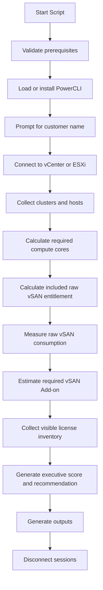
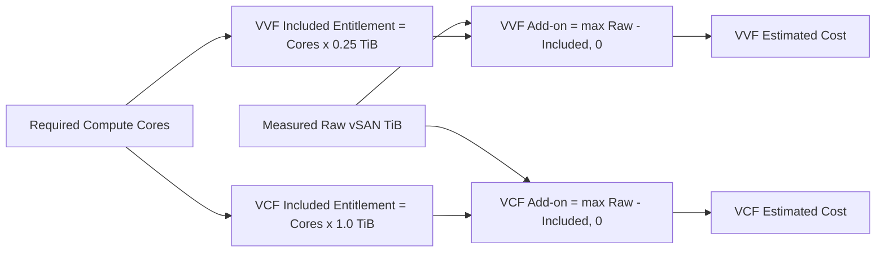

# Broadcom License Assessment Tool


Enterprise-grade PowerShell tool for assessing Broadcom / VMware licensing requirements across one or more vCenter or ESXi environments.

It analyzes compute licensing footprint, bundled raw vSAN entitlement, raw vSAN consumption, vSAN Add-on exposure, visible license inventory, and optionally generates a rough financial comparison between **VVF** and **VCF** using operator-supplied unit prices.

---

## Overview

This tool is designed for:

- infrastructure assessments
- pre-sales and proposal support
- Broadcom licensing reviews
- vSphere / vSAN commercial sizing
- executive reporting

It generates executive-ready outputs in:

- HTML
- JSON
- CSV
- LOG
- PDF, when local export prerequisites are available

---

## Key Features

- Interactive prerequisite validation
- PowerCLI bootstrap and import workflow
- Retry flow for invalid certificates
- Single-run assessment of multiple environments
- Required licensable core calculation
- Included raw vSAN entitlement estimation
- Raw vSAN footprint analysis
- Required vSAN Add-on estimation
- Optional visible license inventory collection
- Executive risk score
- Gartner-style HTML report
- Financial comparison between VVF and VCF
- Final disconnect from active VIServer sessions

---

## How It Works

### Assessment flow



### Financial comparison logic



---

## Requirements

### Operating System
- Windows
- Windows PowerShell 5.1 or later

### PowerShell Modules
- VMware PowerCLI 13 or later

### Access Requirements
- Network reachability to vCenter or ESXi
- Credential with sufficient read access
- Administrative privileges recommended for module installation flows

### Optional
- Microsoft Word for PDF export
- Edge / Chrome / wkhtmltopdf if your script build includes those export fallbacks

---

## Parameters

### Core Parameters

| Parameter | Description |
|---|---|
| `-Help` | Displays help information |
| `-CustomerName <string>` | Customer or company name shown in reports and file names |
| `-DeploymentType <VVF\|VCF>` | Default model used during the assessment prompt |
| `-TrustInvalidCertificates` | Ignores invalid SSL certificates for the current session |
| `-DisconnectWhenDone <bool>` | Disconnects VIServer sessions at the end. Default: `True` |
| `-ExportPdf` | Tries to export the final HTML report to PDF |
| `-CollectLicenseAssignments <bool>` | Collects visible license information when available |

### Financial Estimation Parameters

Use **one currency consistently** across all estimate parameters.

| Parameter | Description |
|---|---|
| `-EstimatedCurrency <string>` | Currency label used in all estimate fields, for example `BRL`, `USD`, or `EUR` |
| `-EstimatedPricePerCore <decimal>` | Fallback per-core price used when model-specific core pricing is not supplied |
| `-EstimatedPricePerCoreVVF <decimal>` | VVF-specific per-core price |
| `-EstimatedPricePerCoreVCF <decimal>` | VCF-specific per-core price |
| `-EstimatedPricePerTiBAddon <decimal>` | vSAN Add-on per-TiB price |

---

## Licensing and Financial Model

### Included raw vSAN entitlement
- **VVF**: `0.25 TiB` per required licensed core
- **VCF**: `1.0 TiB` per required licensed core

### Required vSAN Add-on
```text
Required Add-on = max(Measured Raw vSAN - Included Entitlement, 0)
```

### Estimated total cost
```text
Total Cost = Core Cost + Add-on Cost
```

### Notes
- this is a **rough proposal estimate**
- pricing is entirely based on operator-supplied values
- this is not an official quote
- visible license inventory depends on API visibility and permissions

---

## Example Commands

### Basic assessment
```powershell
.\BroadcomLicenseAssessmentTool.ps1 `
  -CustomerName "ACME Corp"
```

### Financial comparison in BRL
```powershell
.\BroadcomLicenseAssessmentTool.ps1 `
  -CustomerName "ACME Corp" `
  -EstimatedCurrency BRL `
  -EstimatedPricePerCoreVVF 125 `
  -EstimatedPricePerCoreVCF 165 `
  -EstimatedPricePerTiBAddon 450 `
  -ExportPdf
```

### Fallback single core price
```powershell
.\BroadcomLicenseAssessmentTool.ps1 `
  -CustomerName "ACME Corp" `
  -EstimatedCurrency USD `
  -EstimatedPricePerCore 140 `
  -EstimatedPricePerTiBAddon 500
```

---

## Output Files

Generated under the `output` folder in the current working directory:

- `Customer-Broadcom-License-Assessment.html`
- `Customer-Broadcom-License-Assessment.json`
- `Customer-Broadcom-License-Assessment-clusters.csv`
- `Customer-Broadcom-License-Assessment.log`
- `Customer-Broadcom-License-Assessment.pdf` when PDF export succeeds

---

## Report Contents

The HTML executive report includes:

- executive summary
- business interpretation
- decision guidance
- risk score
- visual bars for risk and vSAN exposure
- VVF vs VCF financial comparison
- cluster calculations
- visible license inventory table

---

## Typical Use Cases

- customer discovery workshops
- renewal support
- migration sizing
- commercial proposal preparation
- quick health and entitlement review

---

## Limitations

- Feature-fit guidance between VVF and VCF is advisory
- License inventory may be unavailable depending on permissions or endpoint behavior
- Financial results are only as accurate as the unit prices supplied
- This tool does not replace formal Broadcom commercial validation

---

## Troubleshooting

### Certificate errors
Use `-TrustInvalidCertificates` or accept the retry prompt during connection.

### PowerCLI missing
The tool can prompt to install it for the current user.

### No license inventory returned
This usually indicates API visibility or permission limitations on the connected endpoint.

### PDF not generated
Use the HTML output if Word or local PDF tooling is unavailable.

---

## Example Output Files

- `EXAMPLE-OUTPUT.html`
- `EXAMPLE-OUTPUT.md`
- `EXAMPLE-OUTPUT-Internal.html`
- `EXAMPLE-OUTPUT-Internal.md`

---

## Contribution Notes

Pull requests and improvements are welcome, especially around:

- licensing logic
- reporting quality
- PowerCLI compatibility
- financial modeling enhancements

---

## Disclaimer

This project provides **assessment guidance** and **rough commercial estimation support** only.  
Always validate final licensing interpretation, product eligibility, and pricing with official Broadcom channels before issuing a quote.

---

## License

MIT
